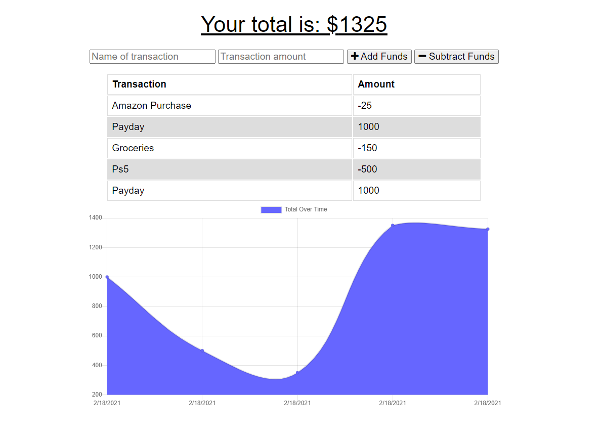

# Progressive Budget 
***
   
### Table of Contents
* [Description](#Description)
* [Installation](#Installation)
* [Usage](#Usage)
* [License](#License)
* [Questions](#Questions)
---

   
### Description 
Thanks for checkout out my project! This application will allow you to track any payments and purchases over time whether you have an internet connection or not! It also displays a chart in order to help visualize your cashflow over time.
   
---
   
### Installation 
To install this project, clone the repo to your local directory then run, npm install to aquire the project dependencies. Next you will need to run npm run-script build in order to bundle the javascript files with webpack. After that, youre ready to run the project with the command node server.js. This application assumes your have a MongoDB server running on your local machine.
   
---
   
### Usage 
When you start the application, you will be greeted with a summary and a graph of all past transactions. At the top of the page there are several input boxes for the name of a transaction you want to submit and a transaction amount. The transaction amount input assumes you are using a positive value, even if you are entering a purchase.  Once you have entered the name and amount, you can press one of two buttons. The add funds button will add the transaction amount to youre current total, and the remove funds buttion will subtract it.
   
---
   
### License 
This project is covered under the MIT license

---
   
   
### Questions 

[brendonstahl97](https://github.com/brendonstahl97)

brendonstahl97@gmail.com
   
---